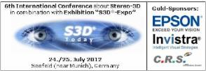

# S3D-Expo 2012 

in combination with

**The following companies did present their products and services:**

| | |
| --- | --- |
| [Carl Zeiss AG](http://cinemizer.zeiss.com/cinemizer-oled/en_de/home.html) | Cinemizer OLED: new generation of HMD with head tracking option |
| [C.R.S. iiMotion GmbH](http://www.crs-iimotion.com/) | - MVComposer® – Studio Ultimate / Studio / OneClick / Stereo-3D Refine  - MVPixelmapper® – Software plugin for Microsoft® DirectShow® |
| [EPSON Deutschland](http://www.epson.de/de/de/viewcon/corporatesite/cms/index/1012) | - Projectors for all 3D technologies  - Multimedia-HMD Moverio BT‑100 (high resolution see-through display, Wi-Fi) |
| Fraunhofer HHI | STAN: algorithm and device for 3D content analysis & quality management |
| [Fujitsu Technology Solutions](http://www.fujitsu.com/fts/products/computing/pc/displays/) | - Monitor for 3D glasses (polarization)  - High-end 3D enabling workstations | 
| [INFITEC GmbH](http://www.infitec.net/) | 2nd generation of passive 3D-filter and glasses |
| [INVISTRA GmbH](http://www.trivido.com/) | - Web platform TRIVIDO.com  - 3D content multiplexer | 
| [m.objects Präsentationstechnik e.K](http://www.mobjects.com/) | m.objects AV software:  Flexible creation and presentation tool for 2D and Stereo-3D content |
| [Marchon Europe BV](http://www.marchon.com/M3D) | 3D desiger glasses3D desiger glasses |
| natural view systems | - iVu-algorithm with intergrated functions for analysis, convertion and diplay adaptation  - Display with integrated iVu-FPGA-module |
| Prisma Augenoptisches Privatinstitut | Measurement of human 3D viewing capability and correspondent correction, if necessary |
| [projectiondesign](http://www.projectiondesign.com/) | 3D enabling high end projectors |
| [REALEYES](http://3dcc.eu/REALEYES.html) | Printed 3D displays without glasses with 250.000 micro-lenses and 30.000 views |
| [Schneider Digital Josef J. Schneider e.K.](http://www.schneider-digital.de/) | - High-end 3D enabling workstations - 3D-Monitor 84" PLANAR UltraRes UR8450-3D with 3840 x 2160 Pixel native resolution, passive polarization |
| [Schott Systeme](http://www.schott-systeme.com/de/index.htm) | Stereo-3D capable software tool for CAD and business graphics |
| SpaceControl | 3D-Mouse |
| Stereotec (Stereoscopic Technologies) | 3D-camera-rigs | 
| [TRIDELITY AG](http://www.tridelity.com/) | Glasses-free 3D displays | 
| [Volfoni GmbH](http://www.volfoni.com/) | - 3D modulators (shutter to polarization) for DLP and LCD projectors  - 3D glasses (shutter and polarization) |
| [WolfVision GmbH](http://3dcc.eu/WolfVision.html) | VZ-C3D Visualizer:  High end video camera systems for live visualization in Stereo-3D and 2D |