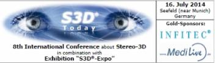

# S3D-Expo 2014 

in combination with

**The following companies did present their products and services:**

| | |
| --- | --- |
| [CIRIC Software GmbH](http://www.ciric.com/) | “MLD Studio Real-time” Embedded 3D toolchain with Multi-Layer Display |
| [INVISTRA GmbH](http://www.trivido.com/) | Web platform TRIVIDO.com |
| [INFITEC GmbH](http://www.infitec.net/) | 2nd generation of passive 3D-filter and glasses |
| [MediLive](http://www.medilive.com/), Film und Multimedia | - Organization, realization and technical planning of live-transmissions, live-surgery and broadcasts - Didactical planning of content and topics - Production of playbacks, trailers, graphics and animations - Post production of recorded live-transmissions for the use of Internet, DVD, PowerPoint presentation etc. - Access of transmission content on the internet |
| [Optoma](http://www.optoma.eu/) | 3D enabled projector - EH503, 1920x1080 - 3D-Funkbrillen System ZF2100 |
| [Schneider Digital Josef J. Schneider e.K.](http://www.schneider-digital.de/) | - High-end 3D enabling workstations - 3D-Monitor 84" PLANAR UltraRes UR8450-3D with 3840 x 2160 Pixel native resolution, passive polarization - 3D zStation monitor, 24 inch HD LCD (1080p 120Hz) with tracking sensors<ul><li>Direct interaction stylus with 3-buttons and integrated infrared LED</li><li>Polarized passive eyewear with trackable markers</li><li>with simulaneous projection on 3m screen using</li><li>120 Hz shutter based projector</li><li>3D modulator (shutter to passive circular polarization)</li><li>polarization projection screen</li><li>passive 3D circular polarization glasses</li></ul> |
| [Schott Systeme](http://www.schott-systeme.de/) | Stereo-3D capable software tool for CAD and business graphics |
| [SeeFront GmbH](http://www.seefront.com/) | Glasses-free 3D monitor 13.3" - with user tracking in x-, y- and z-axes - native resolution 1920 x 1080 pixel |
| [Time-in-the-Box GmbH](http://www.timeinthebox.com/) | - exclusive high-quality 3D-art content - history-focused wikipedia with 3D content|
| [TRIDELITY AG](http://www.tridelity.com/) | Glasses-free 3D displays | 
| [Richard Wolf GmbH](http://www.richard-wolf.com/) | 3D-Endoskopie-System |