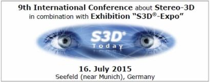

# S3D®-Expo

The **S3D®-Expo** has the concept of a temporary exhibition as part of well-known international trade shows or in combination with specialized conferences and events.

To make it easier to attend, especially to attend the very FIRST time, the S3D®-Expo is carried out as a kind of ROADSHOW.

**The last S3D®-Expo had been held in combination with**

