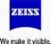
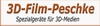

# S3D®-Expo photokina 2008

The "S3D-Expo" has been held at

23.-28. September 2008, Cologne, Germany

---

Exhibitors:  

Sponsors:  

---

Because of the “non-trading character” of the 3D-CC (DNS Consult) as an independent consulting company and because at our booth had been given open presentations and practical demonstrations to public visitors, we could achieve that the “S3D-Expo” had been listed as a

**part of the official “Supporting programme: Activity areas & events” at photokina**

 
As reference, please see also the following [direct link to the official photokina website:](http://photokina.en.koelnmesse.info/thefair/activity_areas_events.php#13)