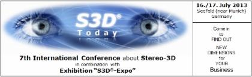

# S3D®-Expo 2013 

in combination with

**The following companies did present their products and services:**

| | |
| --- | --- |
| [3Dims GmbH](http://www.3dims.de/) |- 3D zStation monitor, 24 inch HD LCD (1080p 120Hz) with tracking sensors<ul><li>Direct interaction stylus with 3-buttons and integrated infrared LED</li><li>Polarized passive eyewear with trackable markers</li><li>with simulaneous projection on 3m screen using</li><li>120 Hz shutter based projector</li><li>3D modulator (shutter to passive circular polarization)</li><li>polarization projection screen</li><li>passive 3D circular polarization glasses</li></ul> |
| [Barco projectiondesign](http://www.projectiondesign.com/) | 3D enabling high end projectors |
| [Carl Zeiss AG](http://cinemizer.zeiss.com/cinemizer-oled/en_de/home.html) | Cinemizer OLED: new generation of HMD with head tracking option |
| [C.R.S. iiMotion GmbH](http://www.crs-iimotion.com/) | - MVComposer® – Studio Ultimate / Studio / OneClick / Stereo-3D Refine  - MVPixelmapper® – Software plugin for Microsoft® DirectShow® |
| [INFITEC GmbH](http://www.infitec.net/) | 2nd generation of passive 3D-filter and glasses |
| [Optoma](http://www.optoma.eu/) | 3D enabled projector - EH503, 1920x1080 - 5.000 ANSI Lumen, „Deutschland Premiere“|
| Prisma Augenoptisches Privatinstitut | Measurement of human 3D viewing capability and correspondent correction, if necessary | 
| [Schneider Digital Josef J. Schneider e.K.](http://www.schneider-digital.de/) | - High-end 3D enabling workstations - 3D-Monitor 84" PLANAR UltraRes UR8450-3D with 3840 x 2160 Pixel native resolution, passive polarization|
| [SeeFront GmbH](http://www.seefront.com/) | Glasses-free 3D monitor 13.3" - with user tracking in x-, y- and z-axes - native resolution 1920 x 1080 pixel |
| [TRIDELITY AG](http://www.tridelity.com/) | Glasses-free 3D displays | 
| [Volfoni GmbH](http://www.volfoni.com/) | - 3D modulators (shutter to polarization) for DLP and LCD projectors  - 3D glasses (shutter and polarization) |
