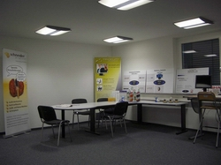
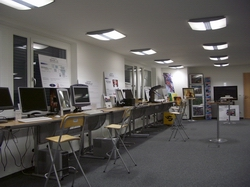

## S3D®-Showroom

## permanent exhibition with professional consulting VIP service

**“The puzzle parts of Stereo-3D are ready to be put in place for an impressing total picture!**
**We will HELP doing so and to BRING the MESSAGE TO THE MARKET… “**
 
 

**General approach:**
The S3D®-Showroom has the clear purpose to PROMOTE Stereo-3D visualization technologies and applications. It will give an overview about the actual status as well as an outlook of the near future.

**SPECIAL TARGET:**
The S3D®-Showroom has the target to show / demonstrate in practice:

- ALL actual 3D visualization technologies
- ALL actual Stereo-3D enabled software applications

Very special focus will be put on the practical use and benefit of the installations.

It will be given suggestions and support for the practical integration in complete systems.

---

- 12 months a year - flexible visits
- „live“ experience of 3D visualization technologies and applications
- independent neutral consultation by 3D-CC qualified personnel
- direct comparison of official products and technologies
- individual consultancy
- individual presentation
- calm atmosphere
- visit is free 

---
